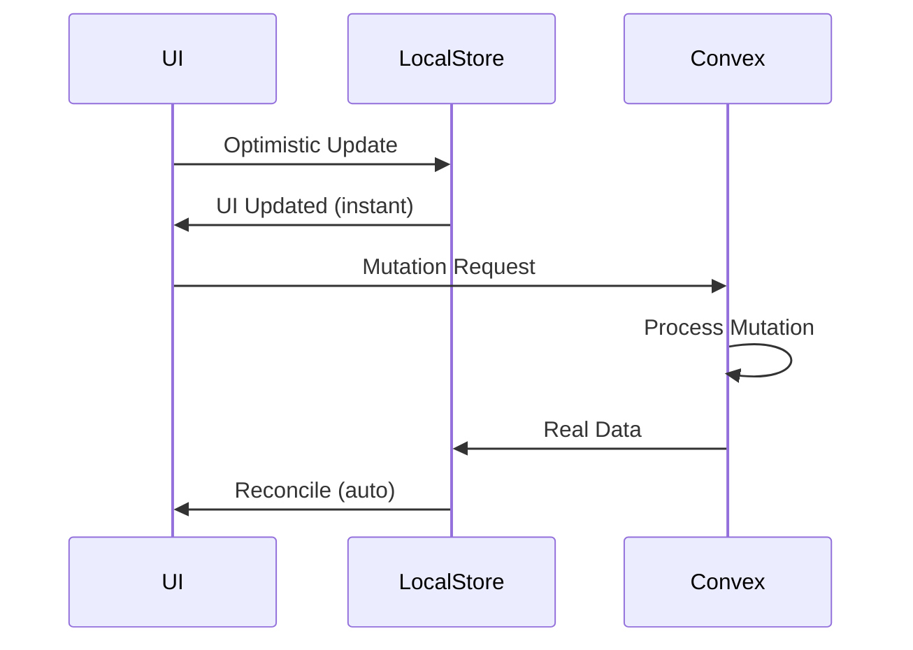

Convex, c'est le backend qui a révolutionné ma façon de coder. Mais après des mois à creuser la doc, j'ai découvert des **pépites cachées** que 90% des développeurs n'exploitent pas.

En tant que Product Engineer, je vais vous révéler les **10 features qui changent tout**.

## 1. Scheduled Functions : Le Cron Killer

Oubliez les cron jobs à configurer sur un serveur. Convex permet de **planifier des fonctions directement depuis votre code**.

```typescript
// Planifier une fonction dans 5 minutes
await ctx.scheduler.runAfter(5 * 60 * 1000, internal.emails.sendReminder, {
  userId: args.userId,
});

// Planifier à une date précise
await ctx.scheduler.runAt(new Date("2026-02-01T09:00:00Z"), internal.reports.generate, {
  reportId: args.reportId,
});
```

**La magie ?** Si votre mutation réussit, la fonction est **garantie** de s'exécuter. Si elle échoue, rien n'est planifié. Atomicité parfaite.

- Jusqu'à **1000 fonctions** planifiées simultanément
- Délai de quelques millisecondes à plusieurs années
- Visible dans le dashboard Convex

## 2. Cron Jobs Natifs

Pour les tâches récurrentes, Convex a son propre système de crons. Créez un fichier `convex/crons.ts` :

```typescript
import { cronJobs } from "convex/server";
import { internal } from "./_generated/api";

const crons = cronJobs();

// Toutes les heures
crons.interval("sync-data", { hours: 1 }, internal.sync.pullFromAPI);

// Chaque jour à 9h UTC
crons.daily("daily-report", { hourUTC: 9, minuteUTC: 0 }, internal.reports.daily);

// Syntaxe cron classique
crons.cron("cleanup", "0 0 * * 0", internal.cleanup.weeklyPurge);

export default crons;
```

**Avantage vs cron traditionnel** : Pas de serveur à maintenir, logs intégrés, et vos jobs sont **versionnés** avec votre code.

## 3. Vector Search Intégré

Pas besoin de Pinecone ou Qdrant pour un MVP. Convex a son propre **moteur de recherche vectorielle**.

```typescript
// schema.ts - Définir l'index vectoriel
export default defineSchema({
  documents: defineTable({
    content: v.string(),
    embedding: v.array(v.float64()),
  }).vectorIndex("by_embedding", {
    vectorField: "embedding",
    dimensions: 1536, // OpenAI embeddings
    filterFields: ["category"],
  }),
});
```

```typescript
// Rechercher les documents similaires
const results = await ctx.vectorSearch("documents", "by_embedding", {
  vector: queryEmbedding,
  limit: 10,
  filter: (q) => q.eq("category", "tech"),
});
```


**Le plus ?** La recherche est **immédiatement cohérente**. Contrairement aux bases vectorielles externes, pas de délai de synchronisation.

## 4. File Storage Sans Config

Upload, stockage, et serving de fichiers en **3 lignes de code**. Pas de S3 à configurer.

```typescript
// Générer une URL d'upload (valide 1h)
const uploadUrl = await ctx.storage.generateUploadUrl();

// Récupérer l'URL publique d'un fichier
const fileUrl = await ctx.storage.getUrl(storageId);

// Supprimer un fichier
await ctx.storage.delete(storageId);
```

**Features cachées :**
- Support de **tous les types de fichiers**
- URLs signées avec expiration
- Streaming depuis les HTTP Actions
- Métadonnées accessibles

## 5. HTTP Actions : Votre API REST

Convex peut exposer des **endpoints HTTP** pour recevoir des webhooks ou créer une API REST.

```typescript
// convex/http.ts
import { httpRouter } from "convex/server";
import { httpAction } from "./_generated/server";

const http = httpRouter();

http.route({
  path: "/webhooks/stripe",
  method: "POST",
  handler: httpAction(async (ctx, request) => {
    const body = await request.json();
    const signature = request.headers.get("stripe-signature");
    
    // Valider et traiter le webhook
    await ctx.runMutation(internal.payments.processWebhook, {
      event: body,
    });
    
    return new Response("OK", { status: 200 });
  }),
});

export default http;
```

Vos endpoints sont accessibles sur `https://votre-projet.convex.site/webhooks/stripe`.

**Use cases :**
- Webhooks (Stripe, GitHub, Discord)
- API publique pour apps tierces
- Intégration avec Zapier/n8n

## 6. Optimistic Updates

Rendez votre UI **instantanément réactive** avant même que le serveur réponde.

```typescript
const addTodo = useMutation(api.todos.add).withOptimisticUpdate(
  (localStore, args) => {
    const currentTodos = localStore.getQuery(api.todos.list);
    if (currentTodos !== undefined) {
      localStore.setQuery(api.todos.list, {}, [
        ...currentTodos,
        { _id: "temp", text: args.text, completed: false },
      ]);
    }
  }
);
```

**Comment ça marche ?**



Si le serveur renvoie des données différentes, Convex **rollback automatiquement** l'update optimiste.

## 7. Internal Functions : L'Encapsulation Parfaite

Les `internalQuery`, `internalMutation`, et `internalAction` sont **invisibles** côté client. Parfait pour la logique sensible.

```typescript
// Accessible uniquement depuis le backend
export const chargeCustomer = internalMutation({
  args: { userId: v.id("users"), amount: v.number() },
  handler: async (ctx, args) => {
    // Logique de facturation sensible
    const user = await ctx.db.get(args.userId);
    await stripe.charges.create({ amount: args.amount, customer: user.stripeId });
    await ctx.db.patch(args.userId, { lastCharged: Date.now() });
  },
});

// Appel depuis une autre fonction
await ctx.runMutation(internal.billing.chargeCustomer, { userId, amount: 1999 });
```

**Sécurité** : Ces fonctions n'apparaissent pas dans l'objet `api` exposé au client. Impossible de les appeler depuis le frontend.

## 8. Pagination Réactive

La pagination Convex est **fully reactive**. Quand un document change, votre page se met à jour automatiquement.

```typescript
// Backend
export const listMessages = query({
  args: { paginationOpts: paginationOptsValidator },
  handler: async (ctx, args) => {
    return await ctx.db
      .query("messages")
      .order("desc")
      .paginate(args.paginationOpts);
  },
});

// Frontend - Infinite scroll automatique
const { results, status, loadMore } = usePaginatedQuery(
  api.messages.list,
  {},
  { initialNumItems: 20 }
);
```

**Le trick ?** Combinez avec l'Intersection Observer pour un **infinite scroll parfait** :

```typescript
useEffect(() => {
  const observer = new IntersectionObserver(
    ([entry]) => entry.isIntersecting && status === "CanLoadMore" && loadMore(20)
  );
  observer.observe(sentinelRef.current);
  return () => observer.disconnect();
}, [status, loadMore]);
```

## 9. Components : Modules Réutilisables

Convex permet de créer des **composants backend** packagés comme des modules NPM.

```typescript
// Installation
npm install @convex-dev/aggregate

// Utilisation
import { Aggregate } from "@convex-dev/aggregate";

const aggregate = new Aggregate<number>(components.aggregate, {
  sortKey: (doc) => doc.createdAt,
  sumValue: (doc) => doc.amount,
});

// Obtenir des stats en temps réel
const stats = await aggregate.sum(ctx, { prefix: ["sales", "2026"] });
```

**Components officiels disponibles :**
- `@convex-dev/aggregate` - Agrégations temps réel
- `@convex-dev/auth` - Authentification complète
- `@convex-dev/rate-limiter` - Rate limiting
- `@convex-dev/crons` - Crons avancés

## 10. Validation avec Zod

Combinez la puissance de **Zod** avec Convex pour une validation avancée :

```typescript
import { zCustomMutation } from "convex-helpers/server/zod";
import { z } from "zod";

const mutation = zCustomMutation(baseMutation);

export const createUser = mutation({
  args: {
    email: z.string().email(),
    age: z.number().min(18).max(120),
    preferences: z.object({
      theme: z.enum(["light", "dark"]),
      notifications: z.boolean(),
    }),
  },
  handler: async (ctx, args) => {
    // args est parfaitement typé et validé
    return await ctx.db.insert("users", args);
  },
});
```

**Avantages vs validators natifs :**
- Validations complexes (regex, min/max, enums)
- Messages d'erreur personnalisés
- Transformations de données
- Réutilisation des schémas

---

## Récapitulatif

| Feature | Use Case | Impact |
|---------|----------|--------|
| **Scheduled Functions** | Emails, rappels, jobs différés | ⭐⭐⭐⭐⭐ |
| **Vector Search** | RAG, semantic search | ⭐⭐⭐⭐⭐ |
| **HTTP Actions** | Webhooks, API REST | ⭐⭐⭐⭐ |
| **Optimistic Updates** | UX instantanée | ⭐⭐⭐⭐ |
| **File Storage** | Upload/download | ⭐⭐⭐⭐ |
| **Components** | Code réutilisable | ⭐⭐⭐ |

---

**Leçon apprise** : Convex n'est pas juste une "base de données réactive". C'est un **backend complet** qui remplace Supabase, Firebase, et même certains services AWS. Creusez la doc, les pépites sont partout.
