Après des dizaines de projets IA, j'ai convergé vers une stack qui coche toutes les cases : **DX de rêve**, **type-safety absolue**, et **scalabilité native**. Pas de compromis.

En tant que Product Engineer, je ne cherche pas la hype. Je cherche ce qui **shippe vite** et **tient la charge**. Voici mon arsenal 2026.

## Le Frontend : Next.js 16 + TypeScript

**Next.js 16** n'est plus un framework, c'est un **runtime**. Avec le Server Components par défaut, le Turbopack stable, et les **Partial Prerendering**, on atteint des performances qu'on croyait réservées aux apps natives.

- **Turbopack** : Build 10x plus rapide que Webpack. Le HMR est instantané.
- **Server Actions** : Plus besoin d'API routes pour les mutations simples.
- **Edge Runtime** : Du code qui s'exécute à 50ms de l'utilisateur, partout dans le monde.

Le tout avec **TypeScript strict**. Pas de `any`, pas de surprise en prod.

## La Communication : tRPC + NestJS

Exit les schémas REST ou GraphQL à maintenir. **tRPC** donne une **API type-safe de bout en bout** sans génération de code.

```typescript
// Le type est inféré automatiquement côté client
const user = await trpc.user.getById.query({ id: "123" });
// user est typé User, pas unknown
```

Pour les services complexes, **NestJS** structure le backend avec une architecture modulaire :

- **Domain-Driven Design** natif avec les modules
- **Dependency Injection** propre
- Écosystème riche : guards, interceptors, pipes

## Le Temps Réel : Convex.dev

**Convex** a changé ma façon de penser le backend. C'est une **base de données réactive** avec des fonctions serverless intégrées.

```mermaid
flowchart TB
    subgraph Client
        A[Next.js App]
    end
    subgraph Convex
        B[Realtime Database]
        C[Server Functions]
        D[Scheduled Jobs]
    end
    subgraph AI Layer
        E[Pinecone]
        F[Qdrant]
        G[OpenAI]
    end
    
    A <-->|WebSocket| B
    A --> C
    C --> B
    C --> E
    C --> F
    C --> G
    D --> C
    
    style A fill:#FC5757,color:#fff
    style B fill:#FC5757,color:#fff
    style C fill:#1a1d24,stroke:#FC5757
```



**Pourquoi Convex ?**

- **Réactivité native** : Les queries se mettent à jour automatiquement. Pas de polling, pas de cache invalidation manuelle.
- **Transactions ACID** : Contrairement à Firebase, vos données sont cohérentes.
- **TypeScript natif** : Le schéma de base génère les types automatiquement.

## L'Intelligence : Pinecone + Qdrant

Pour les projets IA, j'utilise **deux bases vectorielles** selon le use case :

| Critère | Pinecone | Qdrant |
|---------|----------|--------|
| **Scaling** | Serverless, 0 config | Self-hosted ou cloud |
| **Coût** | Pay-per-query | Prévisible |
| **Latence** | ~50ms | ~20ms (self-hosted) |
| **Filtres** | Metadata basique | Filtres complexes |

**Pinecone** pour le MVP et le scaling automatique. **Qdrant** quand on veut du contrôle total et des filtres avancés.

Les deux s'intègrent parfaitement avec un pipeline RAG :

$$similarity(q, d) = \frac{q \cdot d}{\|q\| \times \|d\|}$$

## Le Déploiement : Vercel Edge + PWA

**Vercel** n'est plus optionnel pour Next.js. Les **Edge Functions** permettent :

- **Middleware global** : Auth, A/B testing, geolocation en <1ms
- **ISR On-Demand** : Revalidation ciblée sans rebuild complet
- **Analytics intégrés** : Web Vitals en temps réel

Pour l'expérience mobile, je transforme chaque app en **PWA** :

- **Service Workers** : Offline-first, sync en background
- **Push Notifications** : Engagement sans app native
- **Installation** : Icône sur l'écran d'accueil

## La Stack Complète

Voici comment tous ces éléments s'articulent :

```mermaid
flowchart LR
    subgraph Frontend
        A[Next.js 16]
        B[PWA Layer]
    end
    
    subgraph API
        C[tRPC Router]
        D[NestJS Services]
    end
    
    subgraph Data
        E[Convex DB]
        F[Pinecone/Qdrant]
    end
    
    subgraph Infra
        G[Vercel Edge]
        H[OpenAI/Anthropic]
    end
    
    A --> C
    B --> A
    C --> D
    C --> E
    D --> F
    D --> H
    G --> A
    
    style A fill:#FC5757,color:#fff
    style E fill:#FC5757,color:#fff
    style G fill:#1a1d24,stroke:#FC5757
```



## Pourquoi Cette Stack Gagne

- **Time-to-Market** : Du prototype au prod en 2 semaines, pas 2 mois.
- **Type-Safety** : Zéro bug de typage entre frontend et backend.
- **Scalabilité** : De 0 à 100k users sans rearchitecturer.
- **Coût** : Serverless = on paie ce qu'on consomme.
- **DX** : Hot reload instantané, erreurs explicites, debugging facile.

---

**Leçon apprise** : La meilleure stack n'est pas celle qui a le plus de features. C'est celle qui vous fait **shipper plus vite** tout en dormant tranquille. En 2026, cette combinaison Next.js + Convex + Vector DB est mon arme secrète.
